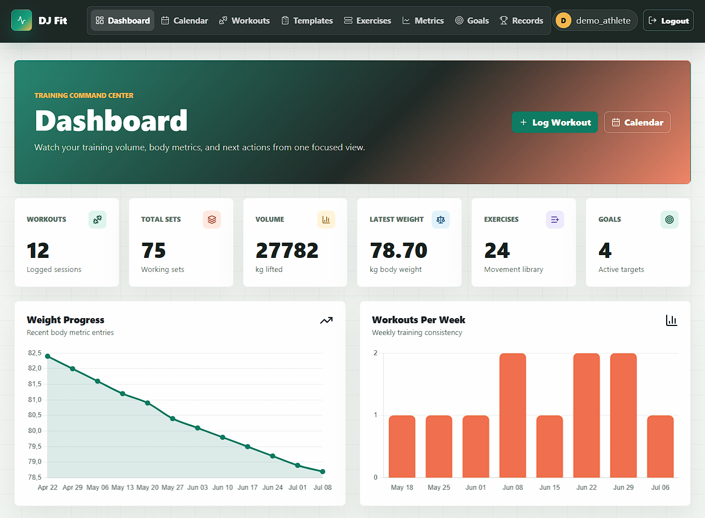
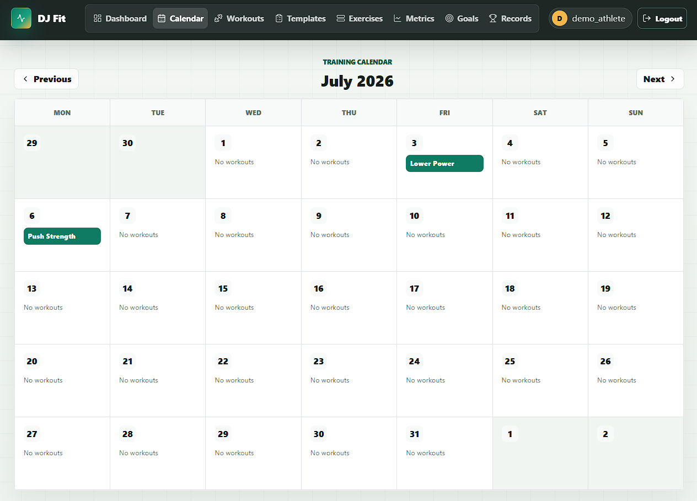

# DJ Fit

A Django fitness tracker for logging workouts, tracking body metrics, managing goals, and reviewing training progress from a protected dashboard. Users can create exercises, record sets, build workout templates, duplicate sessions, view calendar activity, track personal records, and export workout or metric data as CSV files.

## Screenshots

<div align="left">
  <p float="left">
    
    
  </p>
</div>

## Features

- User registration, login, logout, and profile updates
- Protected fitness dashboard
- Workout count, total sets, total volume, latest weight, and active goal summaries
- Weight progress and weekly workout charts
- Workout creation, editing, deletion, and detail pages
- Exercise sets with reps, weight, duration, and distance tracking
- Workout search, date filters, and pagination
- Calendar view for monthly workout history
- Workout duplication
- Save workouts as reusable templates
- Start new workouts from templates
- Template set management
- Shared and user-created exercise library
- Exercise detail pages with best weight, best reps, volume, and progress chart
- Body metric tracking for weight and body fat percentage
- Body metric date filters and pagination
- Goal management with type and status filters
- Personal records summary by exercise
- CSV export for workouts and body metrics
- Seed command for default exercises
- Django admin management for workouts, exercises, metrics, goals, and templates

## Tech Stack

- Python
- Django
- Bootstrap
- PostgreSQL
- Chart.js
- Lucide Icons
- HTML/CSS
- JavaScript

## Main Pages

- `/` - Dashboard
- `/calendar/` - Workout calendar
- `/workouts/` - Workout list with search and filters
- `/workouts/add/` - Add workout
- `/workouts/<id>/` - Workout detail
- `/templates/` - Workout templates
- `/exercises/` - Exercise library
- `/metrics/` - Body metrics
- `/goals/` - Goals
- `/records/` - Personal records
- `/profile/` - User profile
- `/accounts/login/` - Login
- `/register/` - Registration
- `/admin/` - Django admin

## Setup Instructions

```bash
git clone https://github.com/vfb-dev/dj-fit.git
cd dj-fit

python -m venv env
env\Scripts\activate

pip install -r requirements.txt
```

Create a `.env` file in the project root:

```env
SECRET_KEY=your-secret-key
DEBUG=True
DB_NAME=dj_fit
DB_USER=postgres
DB_PASSWORD=your-database-password
DB_HOST=localhost
```

Run the project:

```bash
python manage.py migrate
python manage.py seed_exercises
python manage.py createsuperuser
python manage.py runserver
```

## Author

vfb-dev - Turning ideas into web apps
